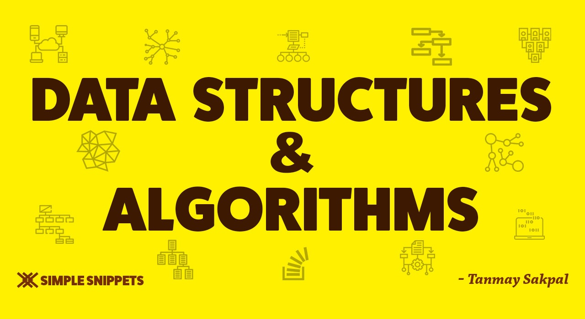

# Data Structures And Algorithms🥇

<h1>Data Structures💯</h1>

  <ol type="1">
         <li> Stack</li>
         <li>Queue</li>
         <li>Circular Queue</li>
         <li>LinkedList Queue</li>
         <li>LinkedList Stack</li>
         <li>Single Linked List</li>
         <li>Doubly Linked List </li>
         <li>Circular Single List</li>
         <li> Circular Doubly List</li>
         <li> Recursive
              <ul> 
                <li>Direct method</li>
                <li>InDirect method</li>
                 <li>Tail method</li>
                 <li>NoN-Tail method</li>
           </ul>
  </li>
     </ol>

